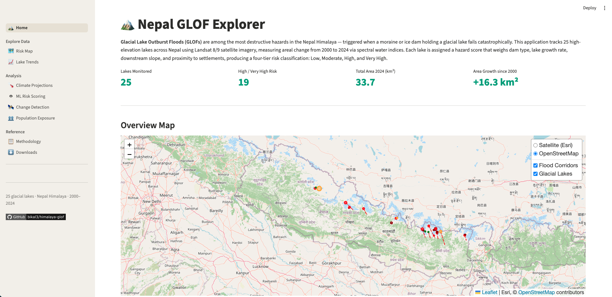

# Nepal GLOF Explorer

An interactive web application for mapping and analysing **Glacial Lake Outburst Flood (GLOF)** hazard across the Nepal Himalaya. It tracks 25 high-elevation glacial lakes from 2000 to 2024 using satellite imagery and applies multi-factor hazard scoring, machine learning, climate projections, and population exposure analysis.

**Live app:** [himalaya-glof.streamlit.app](https://himalaya-glof.streamlit.app) &nbsp;|&nbsp; **GitHub:** [bikal3/himalaya-glof](https://github.com/bikal3/himalaya-glof)



---

## Pages

| Page | Description |
|---|---|
| 🏔️ **Home** | Overview metrics and map of all 25 lakes |
| 🗺️ **Risk Map** | Interactive Folium map with basin filters, risk class filters, and area threshold |
| 📈 **Lake Trends** | Area time-series, basin totals, and risk score distribution charts |
| 🌡️ **Climate Projections** | Lake area forecasts to 2100 under RCP 4.5 and RCP 8.5 scenarios |
| 🤖 **ML Risk Scoring** | Random Forest classifier trained on ICIMOD GLOF events vs formula score |
| 🛰️ **Change Detection** | Sentinel-2 baseline vs latest area comparison with 15% alert threshold |
| 👥 **Population Exposure** | WorldPop + OSM building counts within each lake's downstream flood corridor |
| 📋 **Methodology** | Spectral indices, hazard scoring table, data sources, and GEE script |
| ⬇️ **Downloads** | GeoJSON, CSV, JSON, Sentinel cache, ML model, and PDF report |

---

## Installation

```bash
git clone https://github.com/bikal3/himalaya-glof.git
cd himalaya-glof
pip install -r requirements.txt
streamlit run app.py
```

### Offline data preparation (optional)

The Population Exposure page reads from pre-committed artifacts. To regenerate them from scratch (requires a ~100 MB WorldPop raster download):

```bash
pip install -r requirements-offline.txt
python data/compute_exposure.py
```

---

## Project Structure

```
app.py                          # Navigation controller (st.navigation)
pages/
  0_Home.py                     # Landing page
  1_Map.py                      # Interactive hazard map
  2_Trends.py                   # Lake trend charts
  3_Methodology.py              # Methods and data sources
  4_Downloads.py                # Data downloads
  5_Climate.py                  # RCP 4.5 / 8.5 projections
  6_ML_Risk.py                  # Random Forest risk scoring
  7_Change.py                   # Sentinel-2 change detection
  8_Population.py               # Population exposure analysis
utils/
  data_loader.py                # GeoJSON / CSV loaders
  risk_score.py                 # Hazard formula
  map_builder.py                # Folium map builder
  climate_projections.py        # RCP projection model
  ml_model.py                   # Random Forest train / infer
  change_detection.py           # Sentinel cache diff logic
  exposure.py                   # Population exposure loaders
data/
  lakes_risk.geojson            # 25 lake Point features with hazard scores
  lakes_timeseries.csv          # Annual area measurements 2000–2024
  flood_corridors.geojson       # 8 real downstream LineString corridors
  flood_corridors_buffered.geojson  # 25 ±2 km Polygon corridors
  population_exposure.json      # Pre-computed population + building counts
  sentinel_cache/               # Sentinel-2 derived lake areas (JSON per lake)
  glof_events.csv               # ICIMOD GLOF event catalogue
  compute_exposure.py           # Offline: WorldPop + OSM exposure script
  fetch_sentinel.py             # Offline: Sentinel Hub API fetch
models/
  glof_risk_model.pkl           # Trained Random Forest (joblib)
gee_scripts/
  lake_detection.js             # Google Earth Engine lake delineation script
```

---

## Data Sources

| Dataset | Provider | Resolution | Use |
|---|---|---|---|
| Landsat 8/9 Surface Reflectance | USGS / NASA | 30 m | Lake delineation (MNDWI) |
| Sentinel-2 MSI | ESA | 10 m | Recent area measurements |
| Copernicus DEM GLO-30 | ESA / Copernicus | 30 m | Downstream slope |
| ICIMOD GLOF Database | ICIMOD | — | Event catalogue for ML training |
| WorldPop Nepal 2020 | WorldPop / Univ. of Southampton | 100 m | Population exposure |
| OpenStreetMap | OSM contributors | — | Building footprints |

---

## GEE Script

1. Open [Google Earth Engine Code Editor](https://code.earthengine.google.com/).
2. Paste the contents of `gee_scripts/lake_detection.js`.
3. Click **Run**, then export results to Google Drive via the **Tasks** panel.

---

## Deploy on Streamlit Community Cloud

1. Fork this repository.
2. Go to [share.streamlit.io](https://share.streamlit.io) and connect your GitHub account.
3. Select the repo, branch `main`, entry file `app.py`.
4. Click **Deploy**. No API keys required — all heavy computation is pre-cached.

---

## License

MIT
