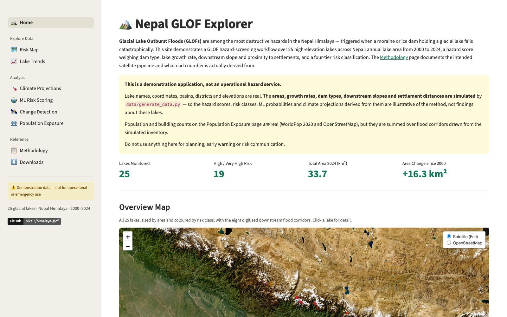

# Nepal GLOF Explorer

An interactive web application demonstrating a **Glacial Lake Outburst Flood (GLOF)** hazard-screening workflow for the Nepal Himalaya. It covers 25 high-elevation glacial lakes from 2000 to 2024 and applies multi-factor hazard scoring, machine learning, climate projections, and population exposure analysis.

> ### ⚠️ Demonstration data — not an operational hazard service
>
> Lake names, coordinates, basins, districts and elevations are real. **Lake areas, growth rates, dam types, downstream slopes and settlement distances are simulated** by `data/generate_data.py`, so every hazard score, risk class, ML probability, change-detection alert and climate projection derived from them illustrates the method rather than describing these lakes.
>
> Population and building counts *are* real (WorldPop 2020 + OpenStreetMap), but they are summed over flood corridors drawn from the simulated inventory.
>
> To run the app on real data, load a real inventory with `data/fetch_icimod.py` and real imagery with `data/fetch_sentinel.py`. Do not use the shipped figures for planning, early warning or risk communication.

**Live app:** [himalaya-glof.streamlit.app](https://himalaya-glof.streamlit.app) &nbsp;|&nbsp; **GitHub:** [bikal3/himalaya-glof](https://github.com/bikal3/himalaya-glof)



---

## Pages

| Page | Description |
|---|---|
| 🏔️ **Home** | Overview metrics and map of all 25 lakes |
| 🗺️ **Risk Map** | Interactive Folium map with basin filters, risk class filters, and area threshold |
| 📈 **Lake Trends** | Area time-series, basin totals, and risk score distribution charts |
| 🌡️ **Climate Projections** | Lake area forecasts to 2100 under RCP 4.5 and RCP 8.5 scenarios |
| 🤖 **ML Risk Scoring** | Random Forest classifier trained on the GLOF event catalogue vs formula score |
| 🛰️ **Change Detection** | Baseline vs latest cached area comparison with 15% alert threshold |
| 👥 **Population Exposure** | WorldPop + OSM building counts within each lake's downstream flood corridor |
| 📋 **Methodology** | Spectral indices, hazard scoring table, data sources, provenance table, and GEE script |
| ⬇️ **Downloads** | GeoJSON, CSV, JSON, area cache, ML model, and PDF report |

---

## Installation

```bash
git clone https://github.com/bikal3/himalaya-glof.git
cd himalaya-glof
pip install -r requirements.txt
streamlit run app.py
```

Run the tests with `python -m pytest tests/ -q`.

### Offline data preparation (optional)

`requirements.txt` holds only what the deployed app needs. The offline scripts have their own dependencies:

```bash
pip install -r requirements-offline.txt

python data/compute_exposure.py   # WorldPop + OSM exposure (~100 MB raster download)
python data/fetch_sentinel.py     # real Sentinel-2 areas (needs Sentinel Hub credentials)
python data/fetch_icimod.py --shapefile /path/to/icimod_nepal_lakes.shp   # real inventory
python data/train_model.py        # retrain the Random Forest after changing either input
```

---

## Project Structure

```
app.py                          # Navigation controller (st.navigation)
pages/
  0_Home.py                     # Landing page
  1_Map.py                      # Interactive hazard map
  2_Trends.py                   # Lake trend charts
  3_Methodology.py              # Methods and data sources
  4_Downloads.py                # Data downloads
  5_Climate.py                  # RCP 4.5 / 8.5 projections
  6_ML_Risk.py                  # Random Forest risk scoring
  7_Change.py                   # Sentinel-2 change detection
  8_Population.py               # Population exposure analysis
utils/
  data_loader.py                # GeoJSON / CSV loaders
  risk_score.py                 # Hazard formula
  map_builder.py                # Folium map builder
  climate_projections.py        # RCP projection model
  ml_model.py                   # Random Forest train / infer
  change_detection.py           # Area cache diff logic
  exposure.py                   # Population exposure loaders
  provenance.py                 # Shared "which numbers are simulated" notices
data/
  generate_data.py              # Generates the simulated inventory and time-series
  lakes_risk.geojson            # 25 lake Point features with hazard scores (simulated)
  lakes_timeseries.csv          # Annual area values 2000–2024 (simulated)
  flood_corridors.geojson       # 8 downstream LineString corridors
  flood_corridors_buffered.geojson  # 25 ±2 km Polygon corridors
  population_exposure.json      # Pre-computed population + building counts (real)
  sentinel_cache/               # Per-lake area cache; each file records its own `source`
  glof_events.csv               # GLOF event catalogue (HKH-wide, unverified attributes)
  compute_exposure.py           # Offline: WorldPop + OSM exposure script
  fetch_sentinel.py             # Offline: Sentinel Hub API fetch
  fetch_icimod.py               # Offline: normalise a real ICIMOD inventory
  train_model.py                # Offline: train and save the Random Forest
models/
  glof_risk_model.pkl           # Trained Random Forest (joblib)
gee_scripts/
  lake_detection.js             # Google Earth Engine lake delineation script
```

---

## Data Sources

| Dataset | Provider | Resolution | Use | In shipped data? |
|---|---|---|---|---|
| Landsat 5/7/8/9 Surface Reflectance | USGS / NASA | 30 m | Lake delineation (MNDWI) | No — pipeline only |
| Sentinel-2 MSI | ESA | 10 m | Recent area measurements | No — needs `fetch_sentinel.py` |
| Copernicus DEM GLO-30 | ESA / Copernicus | 30 m | Downstream slope | No — slopes are simulated |
| ICIMOD GLOF Database | ICIMOD | — | Event catalogue for ML training | Events yes, attributes unverified |
| WorldPop Nepal 2020 | WorldPop / Univ. of Southampton | 100 m | Population exposure | **Yes** |
| OpenStreetMap | OSM contributors | — | Building footprints | **Yes** |

A 2000–2024 Landsat record spans three sensors — Landsat 5 TM and 7 ETM+ for 2000–2012, Landsat 8 OLI from 2013, and Landsat 9 from late 2021.

---

## GEE Script

1. Open [Google Earth Engine Code Editor](https://code.earthengine.google.com/).
2. Paste the contents of `gee_scripts/lake_detection.js`.
3. Click **Run**, then export results to Google Drive via the **Tasks** panel.

---

## Deploy on Streamlit Community Cloud

1. Fork this repository.
2. Go to [share.streamlit.io](https://share.streamlit.io) and connect your GitHub account.
3. Select the repo, branch `main`, entry file `app.py`.
4. Click **Deploy**. No API keys required — all heavy computation is pre-cached.

---

## License

MIT
